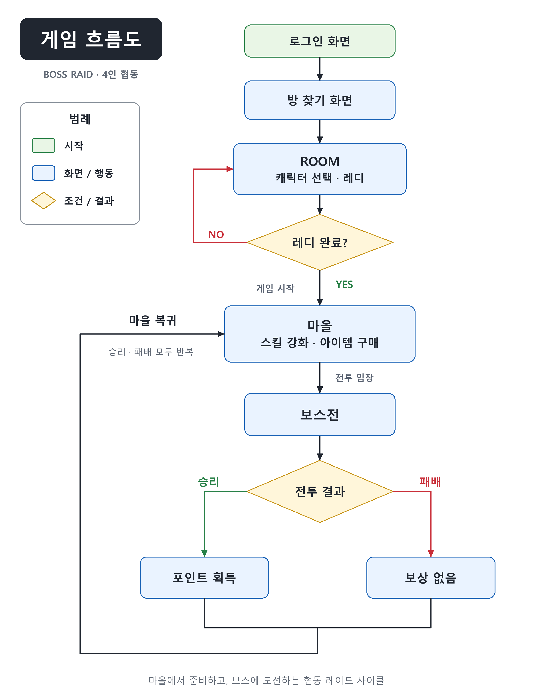

# BossRaid

> 최대 4명의 플레이어가 함께 보스를 공략하는 3D 백뷰 협동 액션 게임

보스의 공격 범위를 확인하고 회피하며, 각자의 공격과 스킬을 활용해 보스를 처치합니다. 마을에서 전투를 준비하고 보스에 도전하는 레이드 사이클을 반복합니다.

## 프로젝트 개요

| 항목 | 내용 |
| :--- | :--- |
| 게임명 | 미정 |
| 프로젝트명 | BossRaid |
| 장르 | 3D 백뷰 협동 액션 / 보스 레이드 |
| 플랫폼 | PC |
| 개발 엔진 | Unity |
| 네트워크 | Photon PUN |
| 개발 인원 | 4명 |
| 최대 플레이 인원 | 4명 |

## 핵심 플레이

- **4인 협동 레이드** — 최대 4명의 플레이어가 협력해 보스를 공략합니다.
- **공격 범위 확인과 회피** — 보스의 공격 범위를 확인하고 회피하며 전투를 진행합니다.
- **캐릭터 선택과 전투 준비** — ROOM에서 캐릭터를 선택하고 레디를 완료한 뒤 게임을 시작합니다.
- **마을에서 성장과 정비** — 스킬을 강화하고 아이템을 구매해 다음 전투를 준비합니다.
- **보스 처치와 보상** — 승리하면 포인트를 획득합니다. 패배하면 보상 없이 마을로 돌아갑니다.

## 게임 흐름

**로그인 → 방 찾기 → ROOM → 마을 → 보스전 → 마을 복귀**

| 단계 | 플레이 내용 |
| :--- | :--- |
| 로그인 | 로그인 화면에서 게임에 진입합니다. |
| 방 찾기 | 함께 플레이할 방을 찾습니다. |
| ROOM | 캐릭터를 선택하고 레디를 완료해 게임을 시작합니다. |
| 마을 | 스킬을 강화하고 아이템을 구매합니다. |
| 보스전 | 보스의 공격을 회피하고 공격과 스킬로 보스를 공략합니다. |
| 결과 및 복귀 | 승리 시 포인트를 획득하고, 패배 시 보상 없이 마을로 복귀합니다. |

**마을 → 보스전 → 결과 처리 → 마을 복귀**를 반복하는 구조입니다.

  

## 조작법

| 행동 | 입력 |
| :--- | :--- |
| 이동 | `W` `A` `S` `D` |
| 시점 조작 | 마우스 이동 |
| 스킬 | `Q` / `E` |
| 구르기 | `Space` |
| 점프 | `F` |
| 공격 | 마우스 좌클릭 |
| 상호작용 | 마우스 우클릭 |
| 아이템 사용 | 숫자 `1` / `2` / `3` |

## 기술 스택

| 기술 | 용도 |
| :--- | :--- |
| Unity | PC용 3D 게임 개발 |
| Photon PUN | 멀티플레이 네트워크 |

## 기획 문서

[Notion 게임 기획서](https://app.notion.com/p/3f26e86e33bc802ab807ff28382ffd93)
